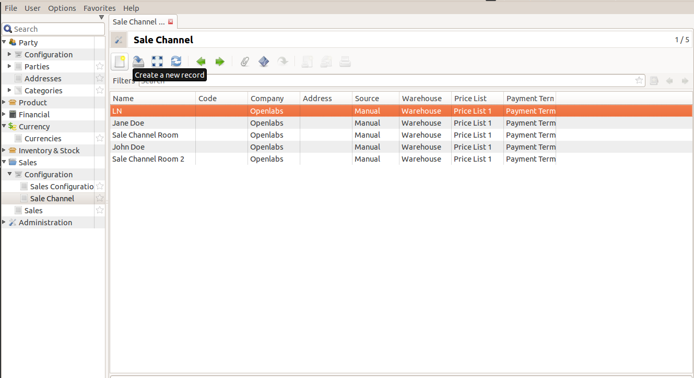
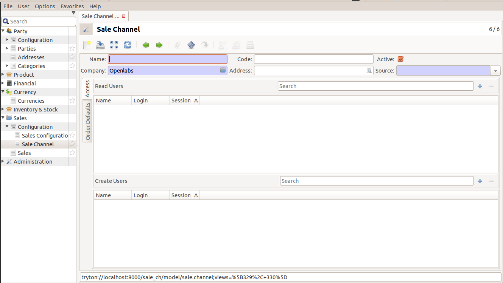
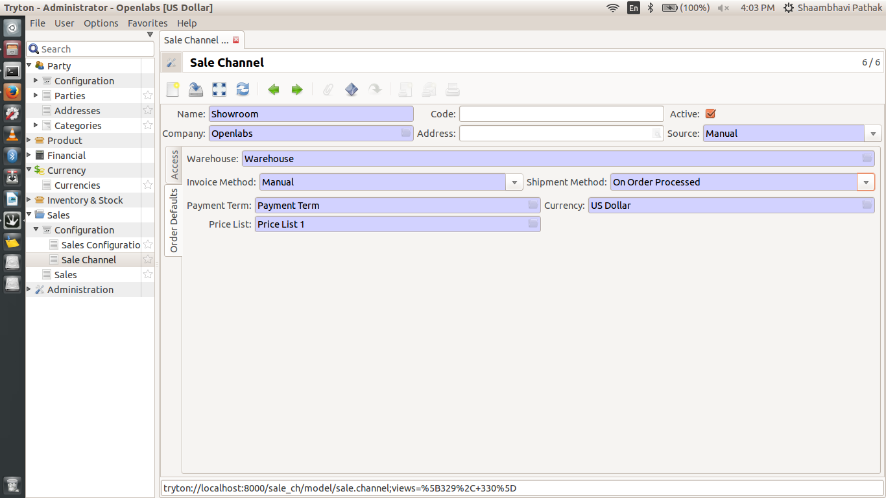
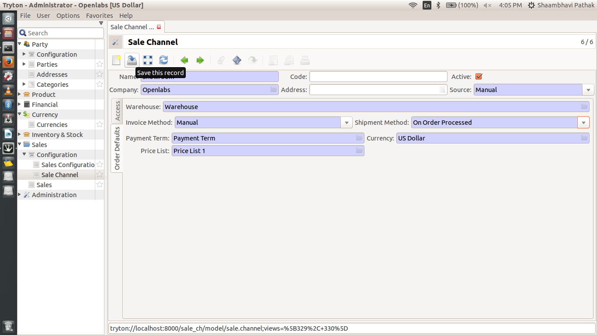
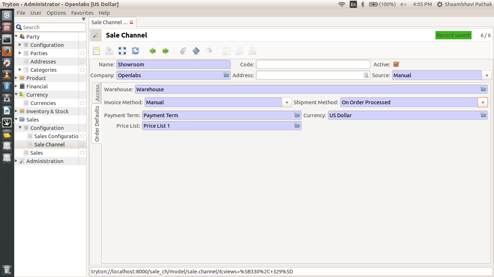
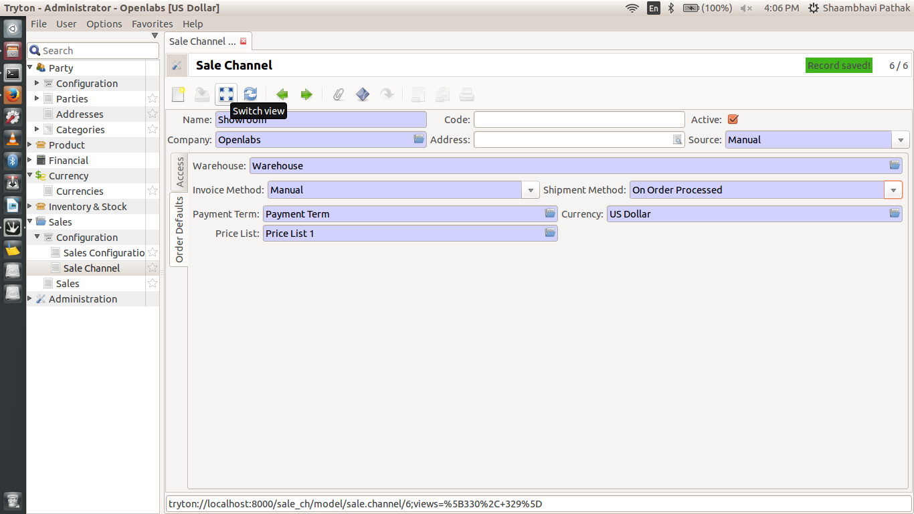
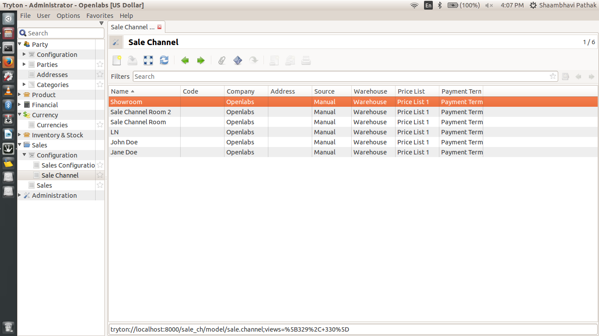

New Sale Channel
=================

This documentation helps user understand how to create a new sale channel.

New Channel Creation 
--------------------

On the top, click on the ``Create a new record`` button.

In the window that pops up, you can see a number of fields.
These are the fields on New Record Window:

* **Name**: The name of your new sales channel. This field is manadatory.
* **Code**: Optional Field to easily lookup channels if you have many. 
* **Company**: This is mandatory field to fill. Each channel has to be
  associated with a company.
* **Address**: If the channel represents a physical location, use the address
  field to add an address. You can only choose from the addresses of your
  company. This is optional field.
* **Source**: The source of orders for the channel. The standard module only
  has a manual option which is used when users key in orders from the Tryton
  sales modules. Downstream modules implement marketplaces like Amazon and
  eCommerce channels like Magento and Shopify.

Order Defaults
++++++++++++++

In this section you can set defaults for orders created in the channel. Some
fields also perform additional roles. Click on the tab which says
``Order Defaults``. The fields are as follows:

* **Warehouse**: The warehouse associated with the channel. All new sale
  orders created from the channel will use this warehouse as the default
  warehouse to fulfill from. If the channel exports stock levels to an
  external application (like Amazon or your eCommerce system), the inventory
  levels exported are of this warehouse.

* **Invoice Method**: This the mandatory field which you use to generate
   invoices. 

* **Shipment Method**: Contains details for Sales Shipment. This field is also
  mandatory.

* **Payment Term**: Set payment term to how you want to pay.

* **Currency**: Default currency for orders. (Defaults to company currency)

* **Price List**: Every Sale generates price list. You can add the details
   here. This field is mandatory.

Once you have filled all these fields, click save this record.

On successful saving, you can see the message, ``Records Saved``.

If you switch views now, you will be able to see your newly created channel in the list.

