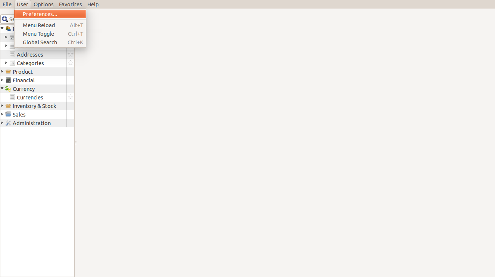
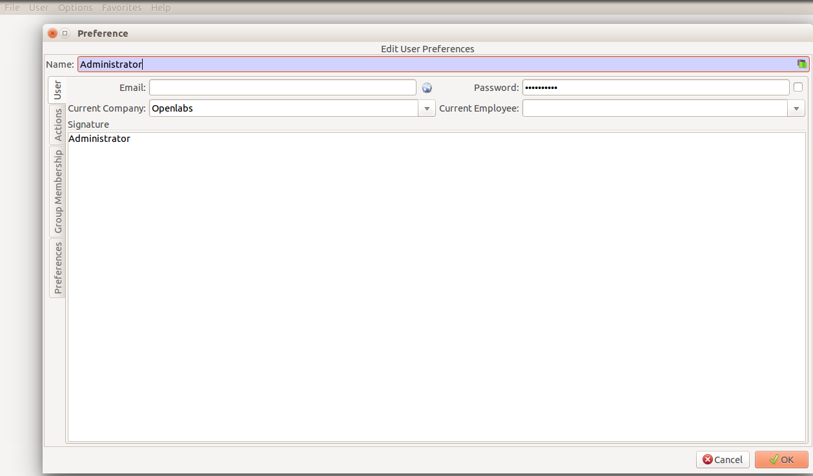
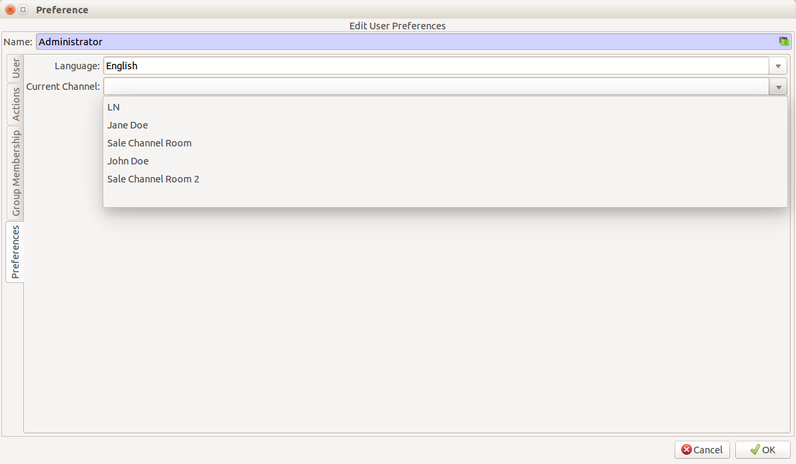
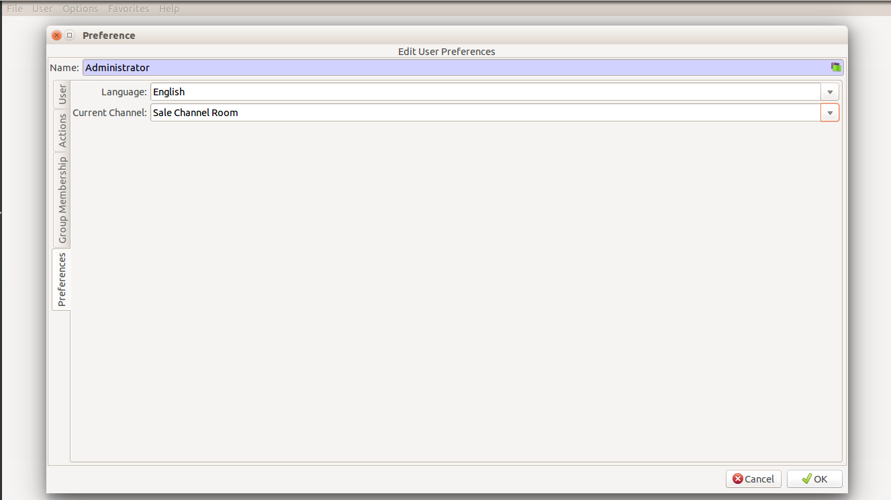
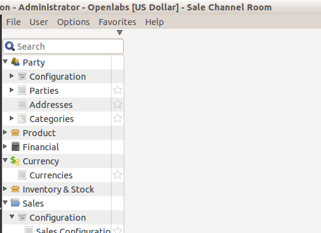
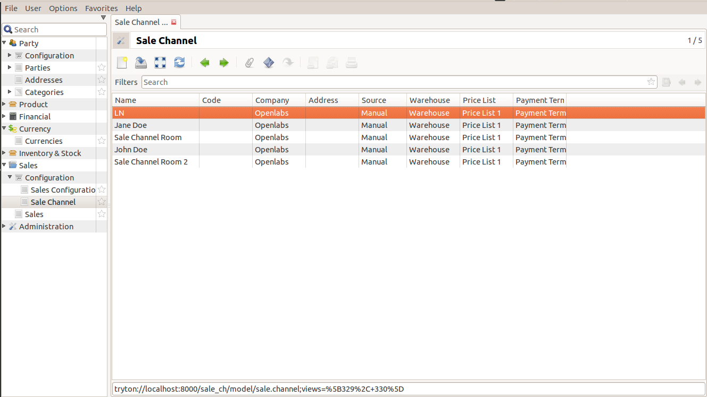

Sales Channel
=============

This guide will give you detailed description of all the fields in the sale
channel module and how sale channel module works.

Initial Steps
-------------

When you login into tryton, you can either create a new sales channel or work
on channels already installed. 

To work on already installed channels, go to ``User >> Preferences``.

Click on Preferences and a new window will pop up.

It will show the default user logged in with password, name, company and
other fields.

Click on Preferences and you can see Languages and Current Channel fields. 

When you click on Current Channel Field, a drop down menu will display
all the sale channels present.

Select a channel and click Ok.

You can see the Sale Channel Name appearing at the top. 

Additionally, you can see all the listed sale channels by double clicking
Sale Channel in ``Sales >> Configuration >> Sale Channel``.

